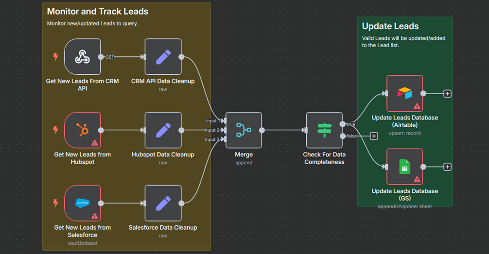
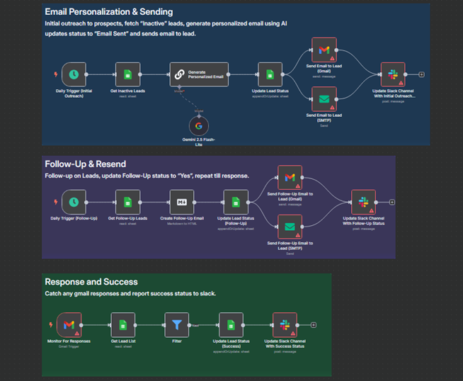

# MSOU (Multi-Source Outreach Unfier)

This is a proof-of-concept n8n workflow and related assets for automating sales outreach from multiple data sources by aggregation and data validation.

---

## Workflow Images Gallery

Below is a gallery showcasing key screenshots of the n8n workflow nodes and flow diagrams.

### Data Ingestion

### Email Outreach

---

## Tool Stack

* n8n
* Hubspot
* Salesforce
* Airtable
* Google Sheets
* Gmail
* SMTP (Email)
* Markdown
* Model: Gemini 2.5 Flash-Lite

---

## Additional Documentation

The sample dataset used in this automation can be found here: [GITHUB SAMPLE LEADS](https://docs.google.com/spreadsheets/d/1Jj-JmLzVlNysVdX3du7nrXdkof1D4uT2ZvKMkf_RCv0/edit?gid=0#gid=0). This is an aggregated list from [SAMPLE CSV FILES](https://github.com/datablist/sample-csv-files).

Further detailed write-up, including design choices, toolsets, etc., can be found in [MULTI-SOURCE OUTREACH UNIFIER](https://docs.google.com/document/d/1E_TGf-VTY7wtICi2pGYG44vwWV-BgRZUwazndJaAYnk/)

---

## License

This proof-of-concept is licensed under the MIT License.

